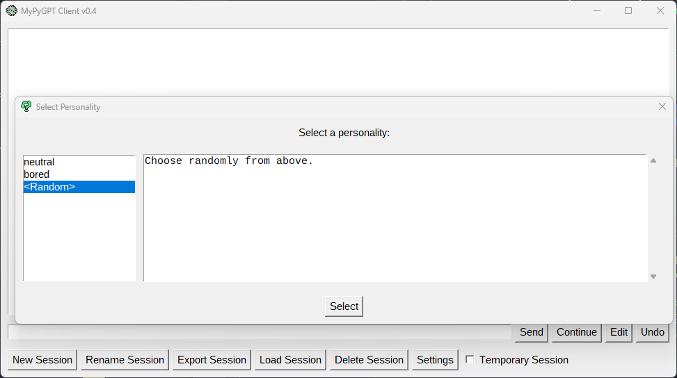
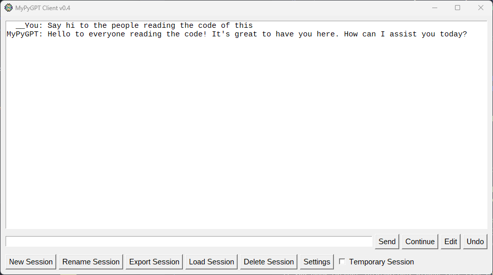
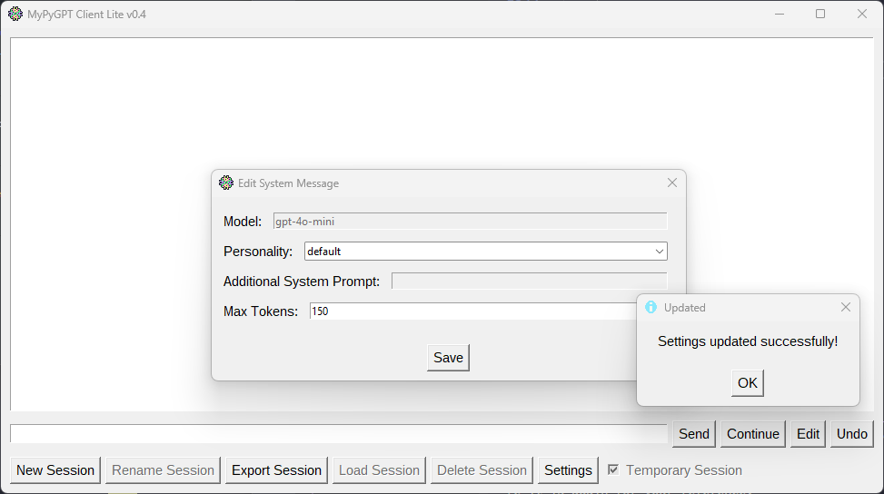
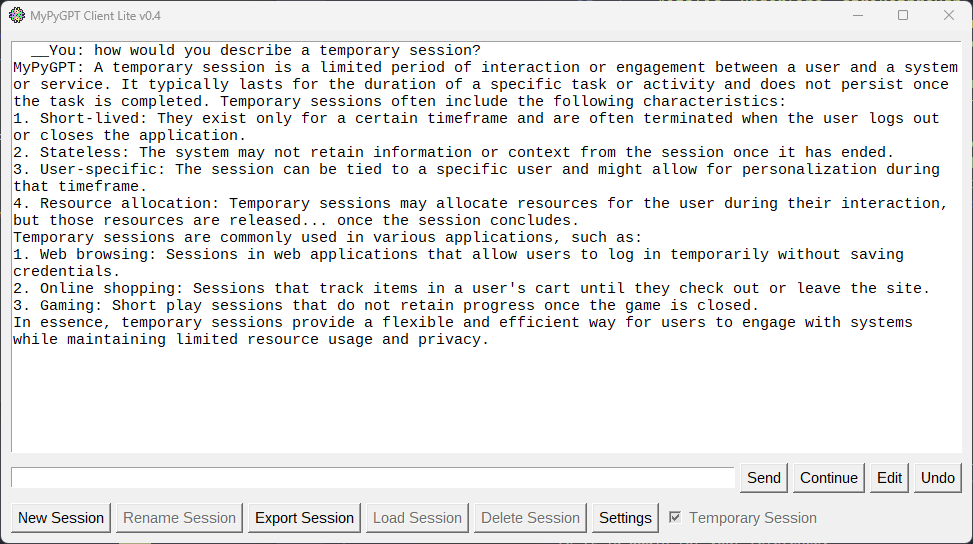

# MyPyGPT

[](http://www.wtfpl.net/about/)

A very simple and minimalistic ChatGPT client written in Python with TKinter.

|     Personality selection      |   Chat sample (normal mode)    |      Settings (lite mode)      |    Chat sample (lite mode)     |
| :----------------------------: | :----------------------------: | :----------------------------: | :----------------------------: |
| [](pics/mypygpt-1.png) | [](pics/mypygpt-2.png) | [](pics/mypygpt-3.png) | [](pics/mypygpt-4.png) |

This will create a `session` folder to store its sessions, including all current settings.

In order to use it, you must generate an API key to access ChatGPT and save it into an environment variable called `OPENAI_API_KEY`. After that, you just need to set up to run this program (see steps 1-5 of [Building an exe](#building-an-exe-step-by-step)), then run with `python mypygpt.py`, and you're good to go.

## Customization

### Personalities

Custom personalities can be written in `personalities.py` by including at least a `DEFAULT_PERSONALITY` (str) and a `PREDEFINED` (dict[str, str]) constants similar to these:

```python
DEFAULT_PERSONALITY = "neutral"

# name: prompt
PREDEFINED = {
    DEFAULT_PERSONALITY: "Act according to your default behaviour.",
    "Alt": (
        "You should have an alternate personality that is actively "
        "different than your current behaviour."
    ),
}
```

If no custom personalities are present, then the default hardcoded values will be used.

### Lite mode

A lite mode can be activated which functions as a permanently turned on "temporary session" toggle. In this mode, you can only change the max number of tokens for responses and the personality.
No session files will be created. If you want to save the conversation, you have to either export it or copy-paste it from its textbox.

## Building an exe (step-by-step)

1. Clone the project (`git clone <this repo>`) and navigate into its root.
2. Set up virtual environment (e.g. `python -m venv venv`).
3. Activate environment (`venv\Scripts\activate.bat` if Windows, else `source venv/bin/activate`).
4. Update pip (`python -m pip install --upgrade pip`).
5. Install requirements (`pip install -r requirements.txt`).
6. Run pyinstaller from root (`pyinstaller --onefile --windowed --noconsole --icon=default.ico mypygpt.py`).
7. Copy the resulting executable from the new `dist/` folder to your desired location along with the icons (`*.ico`) from root.

## Future plans

- Check for the presence of icons and don't attempt to use them if they are not present.
- Add a button in settings to switch between lite and normal mode (relaunch?).
- Add "command line commands" (basically for every function made possible on the UI).
- Add a way to upload an image and pass it along with some text.
- Add a way to upload text files and pass it along with some text.
- Add command line parameters to run in different modes (e.g. lite mode).
- Create a better way to input integers (scrollbar + restricted entry).

## License

This project is licensed under WTFPL 2 for shameful reasons. For more information, see [LICENSE](./LICENSE).
